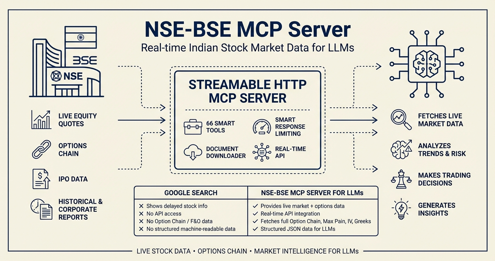

# NSE-BSE MCP Server

Model Context Protocol server for NSE and BSE India stock market APIs using Streamable HTTP transport.

Get real-time Indian stock market data and let LLMs do the analysis for you.


## Quick Start

```bash
npx nse-bse-mcp
```

Or run from source:

```bash
# Requires Bun: https://bun.sh
bun install
bun run build
bun start
```

## Docker Deployment

```bash
cd docker
docker-compose up -d
```

Server will be available at `http://localhost:3000/mcp`

## MCP Client Setup (Gemini CLI, Claude Desktop, ChatGPT)

```json
{
  "mcpServers": {
    "nse-bse-mcp": {
      "command": "npx",
      "args": ["-y", "mcp-remote@latest", "http://localhost:3000/mcp", "--allow-http"]
    }
  }
}
```

## Features

- **61 Tools** (39 NSE + 20 BSE + 2 Document)
- **Smart Response Limiting** - Returns metadata for large responses, letting LLM decide what to fetch
- **Document Downloader** - Download and extract IPO prospectus, reports, circulars
- **Streamable HTTP** transport (stateless)
- **CORS** support for browsers
- **Health check** endpoint
- **Production ready**

## Tools (61 Total)

### NSE Tools (39)

#### Market Data (6 tools)
- `nse_get_market_status` - Current market status and trading hours
- `nse_equity_quote` - Real-time equity quotes
- `nse_get_quote` - Quote with segment specification (equities, sme, mf, debt)
- `nse_lookup_symbol` - Search symbols by name or partial match
- `nse_get_gainers` - Top gainers from market data
- `nse_get_losers` - Top losers from market data

#### Historical Data (4 tools)
- `nse_equity_historical` - Historical equity data with date range
- `nse_index_historical` - Historical index data
- `nse_fno_historical` - Historical F&O data
- `nse_vix_historical` - Historical VIX (volatility index) data

#### Options & Derivatives (7 tools)
- `nse_get_expiry_dates` - Get available expiry dates for a symbol (call first!)
- `nse_option_chain` - Complete option chain with all strikes (V3 API)
- `nse_filtered_option_chain` - Compact option chain around ATM strikes (~90% smaller)
- `nse_compile_option_chain` - Pre-calculated analytics (ATM, max pain, PCR, OI)
- `nse_calculate_max_pain` - Max pain strike price calculation
- `nse_fno_lots` - F&O lot sizes for all symbols
- `nse_futures_expiry` - Futures expiry dates

#### Corporate Information (5 tools)
- `nse_corporate_actions` - Dividends, splits, bonuses
- `nse_corporate_announcements` - Corporate announcements
- `nse_board_meetings` - Board meeting information
- `nse_annual_reports` - Company annual reports
- `nse_circulars` - NSE circulars

#### IPO Tools (4 tools)
- `nse_current_ipos` - Current/ongoing IPOs
- `nse_upcoming_ipos` - Upcoming IPOs
- `nse_past_ipos` - Past IPOs with date range
- `nse_ipo_details` - Detailed IPO information

#### Market Activity (3 tools)
- `nse_block_deals` - Block deals data
- `nse_bulk_deals` - Bulk deals data
- `nse_holidays` - Market holidays (trading/clearing)

#### Lists & Metadata (6 tools)
- `nse_list_indices` - All NSE indices
- `nse_list_stocks_by_index` - Stocks in specific index
- `nse_list_etf` - All ETFs
- `nse_list_sme` - All SME stocks
- `nse_list_sgb` - All Sovereign Gold Bonds
- `nse_equity_meta_info` - Equity symbol metadata

#### Download Tools (4 tools)
- `nse_download_equity_bhavcopy` - Equity bhavcopy reports
- `nse_download_delivery_bhavcopy` - Delivery bhavcopy reports
- `nse_download_indices_bhavcopy` - Indices bhavcopy reports
- `nse_download_fno_bhavcopy` - F&O bhavcopy reports

### BSE Tools (20)

#### Market Data (6 tools)
- `bse_quote` - Real-time stock quotes by scrip code
- `bse_quote_weekly_hl` - 52-week and monthly high/low data
- `bse_gainers` - Top gainers with group/index filtering
- `bse_losers` - Top losers with group/index filtering
- `bse_advance_decline` - Advance/decline values for all indices
- `bse_near_52week` - Stocks near 52-week high/low

#### Historical Data (2 tools)
- `bse_index_historical` - Historical index data (daily/weekly/monthly)
- `bse_all_indices_by_date` - All indices data for specific date

#### Corporate Information (3 tools)
- `bse_corporate_actions` - Corporate actions with advanced filtering
- `bse_announcements` - Corporate announcements with categories
- `bse_result_calendar` - Corporate result calendar

#### Search & Lookup (4 tools)
- `bse_lookup_symbol` - Search by name, symbol, ISIN, or scrip code
- `bse_get_scrip_name` - Get symbol name from scrip code
- `bse_get_scrip_code` - Get scrip code from symbol name
- `bse_list_securities` - List securities with industry/group filters

#### Report Downloads (2 tools)
- `bse_download_bhavcopy` - Daily bhavcopy reports
- `bse_download_delivery` - Daily delivery reports

#### Metadata (2 tools)
- `bse_fetch_index_names` - List of all BSE indices
- `bse_fetch_index_metadata` - Index report metadata

### Document Tools (2)

#### Document Processing (2 tools)
- `download_document` - Download and extract documents (PDFs, text, compressed files)
- `read_document_pages` - Read specific pages from cached or new documents

All tools support **Smart Response Limiting** with `max_items` and `fields` parameters to handle large datasets efficiently.


## License

MIT
